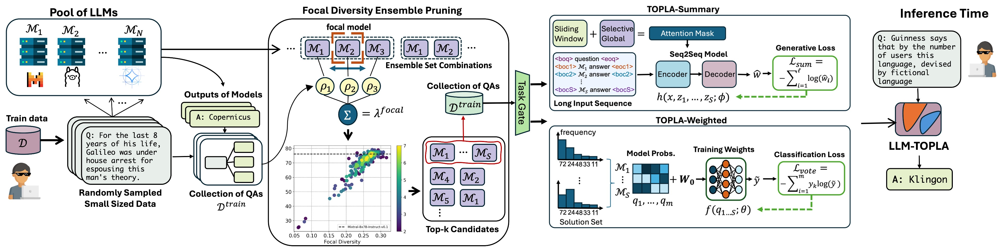

# LLM-TOPLA: Efficient LLM Ensemble by Maximising Diversity



## Install

```
$ pip install requirements.txt
```

## Datasets

MMLU and GSM8k datasets can be downloaded from the link below and must be put in `data/` folder. 

```
https://drive.google.com/drive/folders/1DvZPrUSNoJoM-lFlF7dFWV_v6xwAyEWU?usp=sharing
```

SearchQA and XSUM datasets can be downloaded from Huggingface with the following code. The code will be called during execution.

```
dataset = load_dataset("EdinburghNLP/xsum", split=dataset_name, trust_remote_code=True)
```

```
dataset = load_dataset("search_qa", "train_test_val", split=dataset_name, trust_remote_code=True)
```

## Basemodel Outputs

The base model outputs of these datasets are can be downloaded from the link below and must be put inside `results/`

```
https://drive.google.com/drive/folders/17_5JN5koFKsnyty9klNz1nBGYLKSE4tw?usp=sharing
```


## Run

To train LLM-TOPLA-Weighted on GSM8k or MMLU outputs of phi-2, Mixtral, and LLama

```
$ python topla_weighted.py --task_name gsm8k --model_ids 237 
```

To train LLM-TOPLA-Summary on GSM8k or SearchQA

```
$ python topla_open_ended.py --task_name search_qa --model_ids 237 
```

To train LLM-TOPLA-Summary on XSUM

```
$ python topla_summary.py --task_name xsum --model_ids 0123 
```
